# Blogic Bazar

Interní bazarová aplikace pro zaměstnance firmy Blogic. Umožňuje nabízet věci k prodeji nebo přenechání zdarma mezi kolegy.

## Ukázky

### Domovská stránka
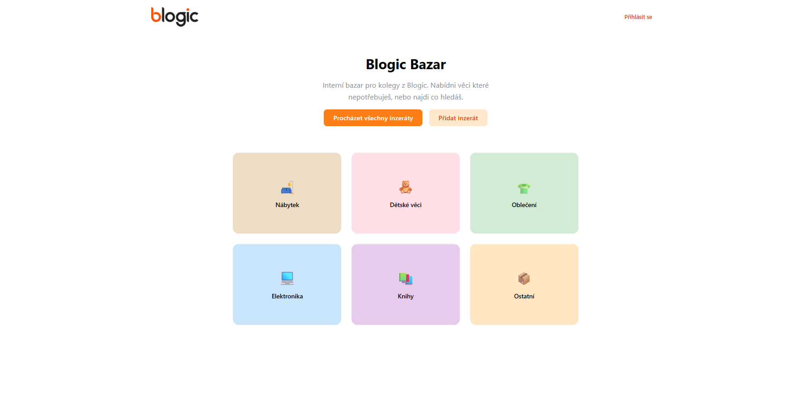

### Přehled inzerátů
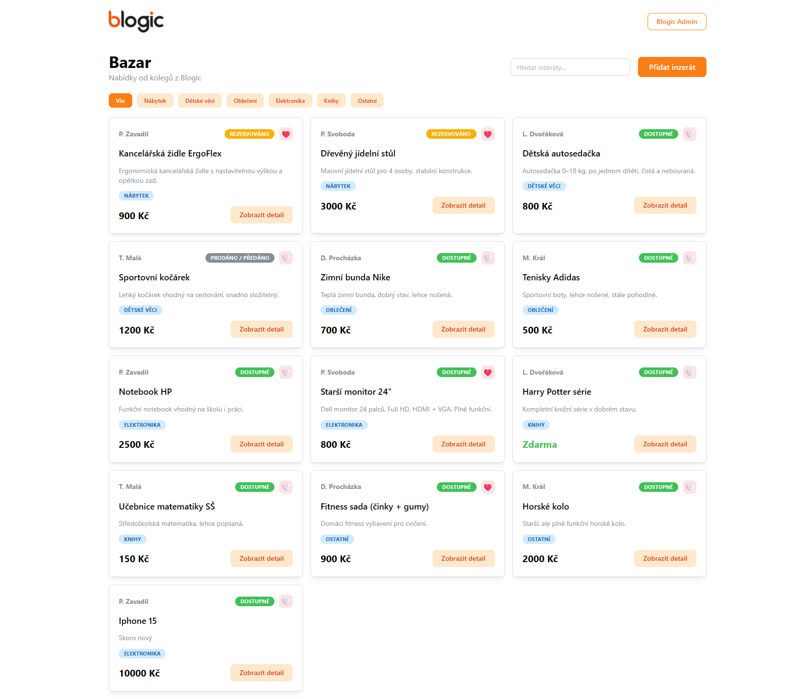

### Vytvoření inzerátu
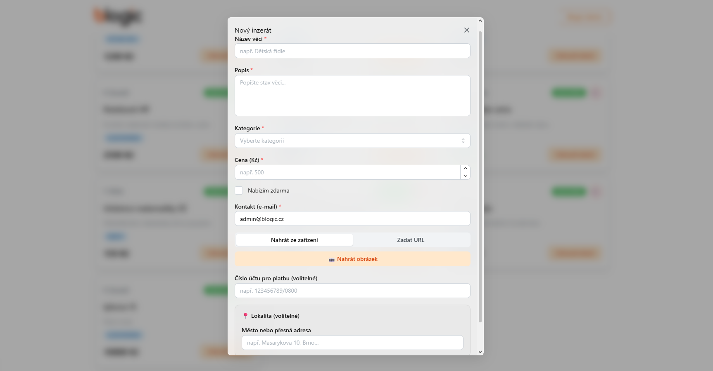

### Detail inzerátu
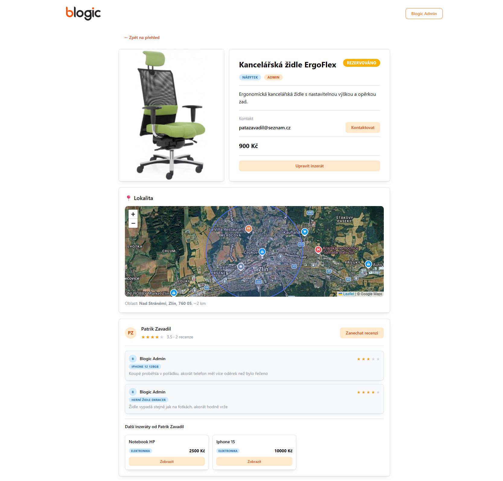

### Platba přes QR kód
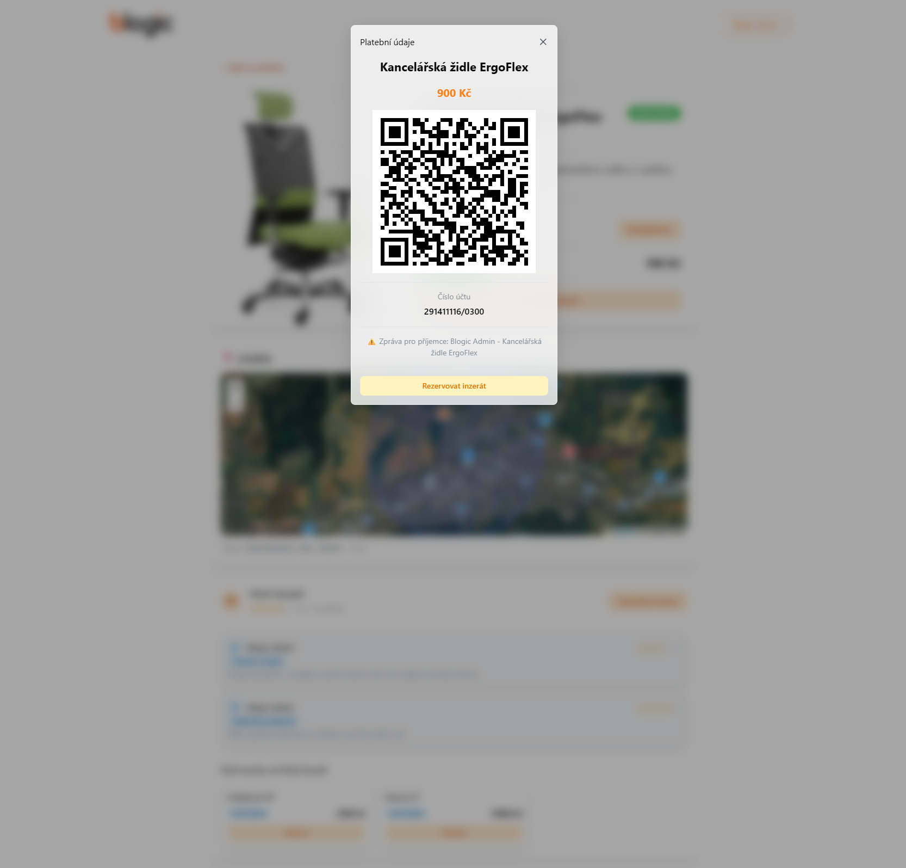

### Kontaktní formulář
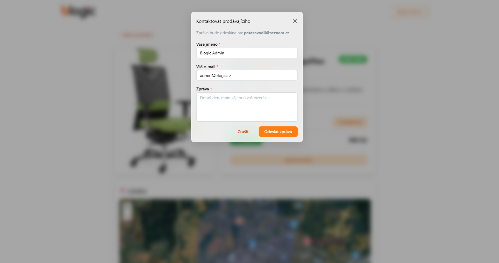

### Zanechání recenze
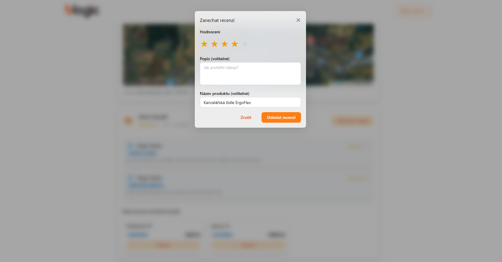

### Zobrazení mých recenzí
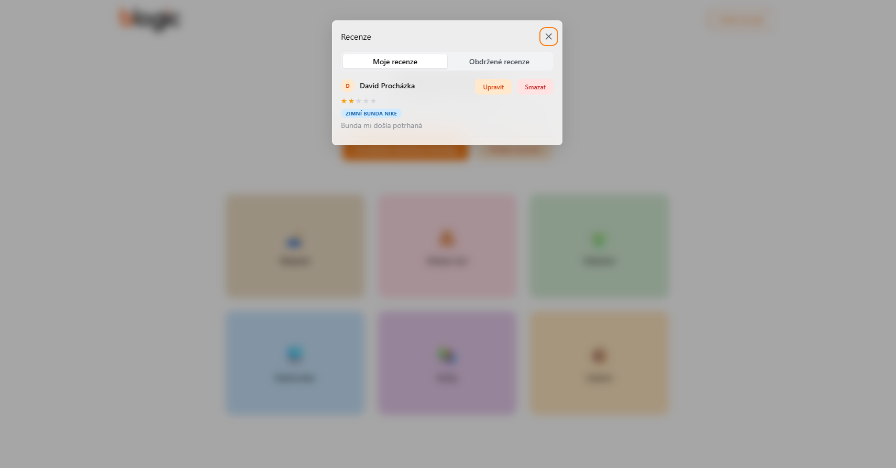

### Zobrazení obdržených recenzí
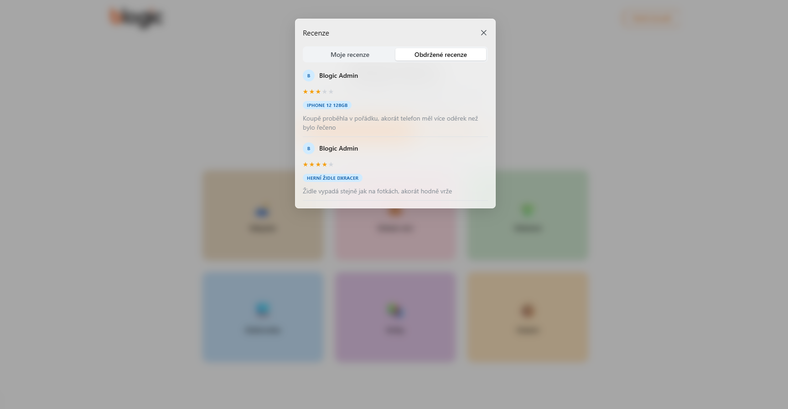

### Registrace
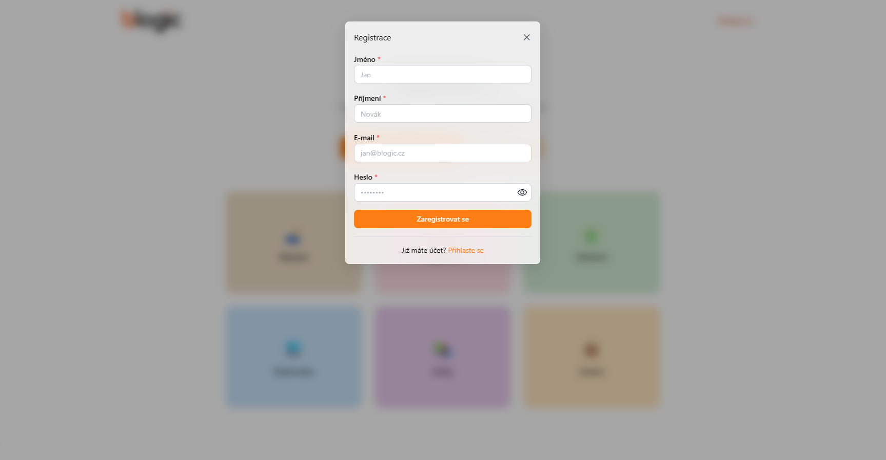

### Přihlášení
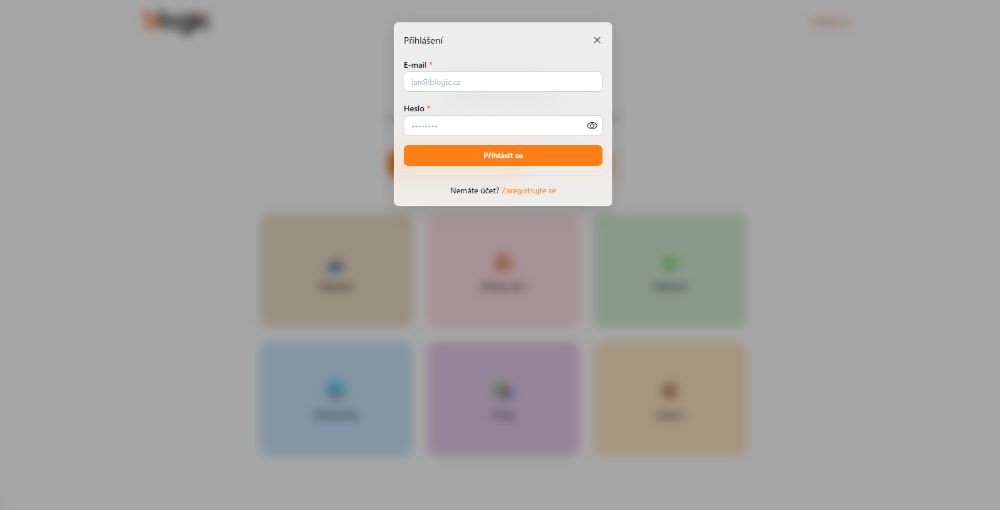

### Nastavení účtu
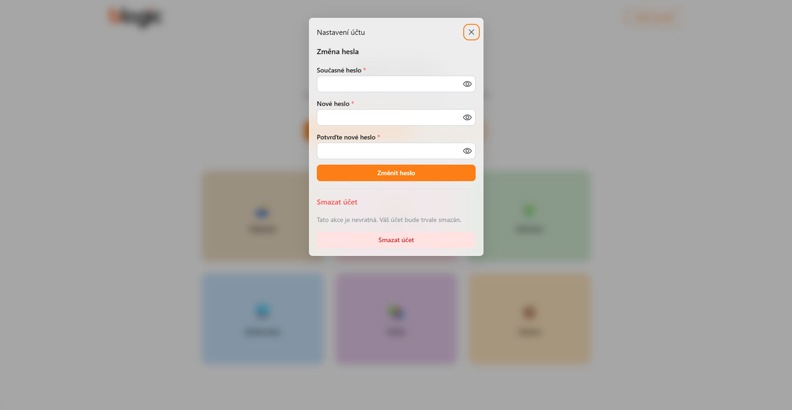

### Admin rozhraní - správa uživatelů
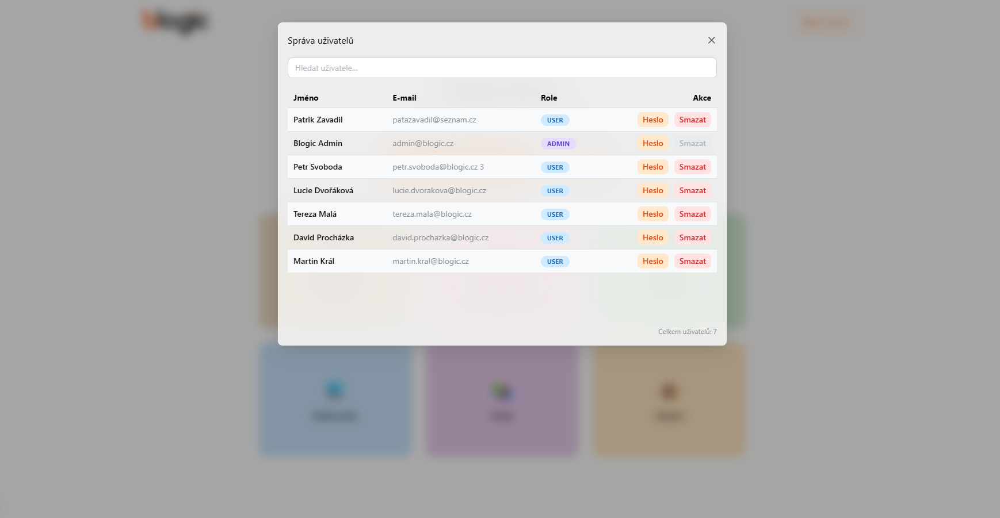

## Funkce

- Přehled inzerátů s filtrováním podle kategorie a vyhledáváním
- Detail inzerátu s fotografií a mapou lokality
- Přidání, úprava a smazání inzerátu
- Nahrání obrázku ze zařízení nebo přes URL
- Přihlášení a registrace uživatelů
- Role admin — správa všech inzerátů a uživatelů
- Oblíbené inzeráty
- Recenze prodávajících s hodnocením hvězdičkami
- Platba přes QR kód generovaný z čísla účtu (SPD formát)
- Rezervace inzerátu přes platební okno
- Kontaktování prodávajícího emailem
- Dropdown menu s nastavením účtu

## Technologie

| Technologie | Použití |
|---|---|
| Next.js 16 | Framework — routing, server komponenty, server akce |
| React 19 | Uživatelské rozhraní |
| TypeScript | Typový systém |
| Mantine UI | Komponenty uživatelského rozhraní |
| Drizzle ORM | Práce s databází |
| SQLite | Lokální databáze |
| bcryptjs | Hashování hesel |
| qrcode | Generování QR kódů |
| Resend | Odesílání emailů |
| Leaflet | Interaktivní mapa |
| next-intl | Lokalizace |

## Spuštění projektu

### Požadavky
- Node.js 20+
- npm

### Instalace

```powershell
# Naklonuj repozitář
git clone https://github.com/PatrikZav/blum-bazar.git
cd blum-bazar

# Nainstaluj závislosti
npm install

# Vytvoř soubor .env.local a přidej API klíč pro Resend
# RESEND_API_KEY=tvůj_klíč

# Připrav databázi
npm run db:migrate

# Vlož ukázková data
npx tsx src/db/seed.ts

# Spusť vývojový server
npm run dev
```

Aplikace bude dostupná na `http://localhost:3000`.

### Příkazy

| Příkaz | Popis |
|---|---|
| `npm run dev` | Spustí vývojový server |
| `npm run build` | Sestaví produkční build |
| `npm run start` | Spustí produkční server |
| `npm run db:migrate` | Spustí migrace databáze |
| `npm run db:studio` | Otevře Drizzle Studio |
| `npm run lint` | Zkontroluje kód |
| `npm run format` | Naformátuje kód |

## Autor

Patrik Zavadil — praxe ve firmě Blogic, květen 2026
